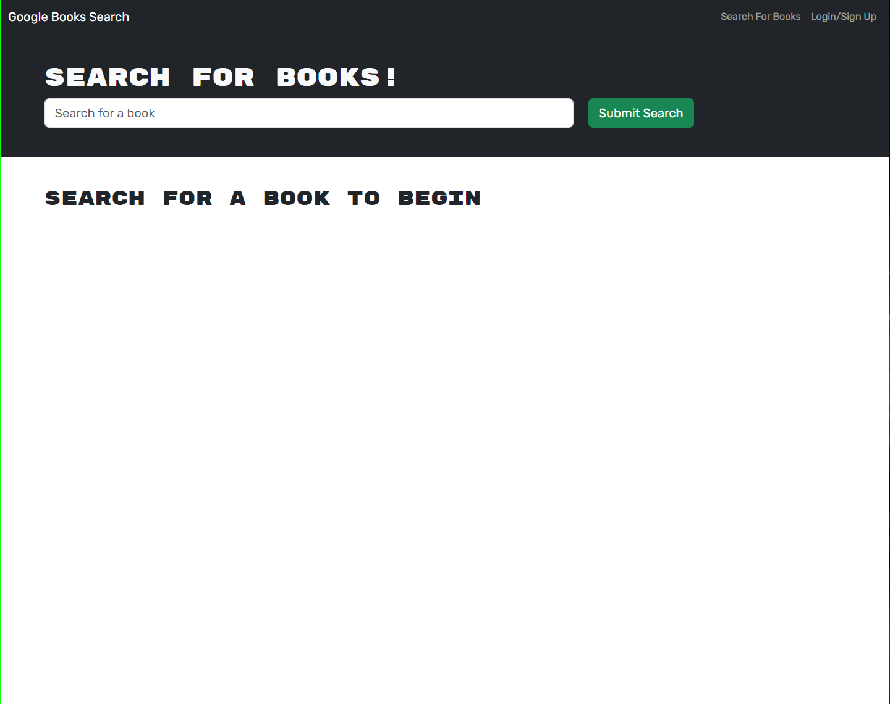

# book-search-engine

## Description
This project is a MERN stack application that allows users to search for books, save books to a list, and view the books in their list. It uses the Google Books API to retrieve book data.

## Screenshot

## Link
https://book-search-engine-p7l0.onrender.com/